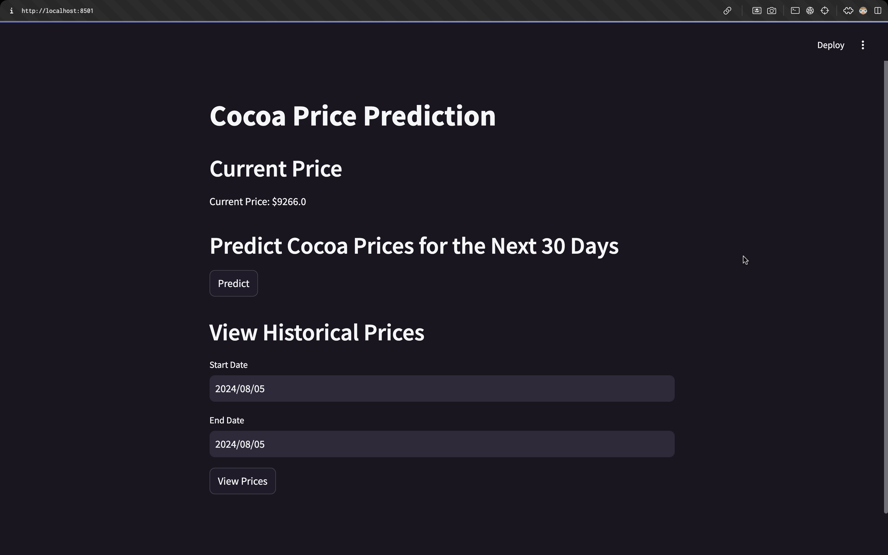

# Group35_CocoaPricePrediction

<h1 align="center">🌍 Predictive Analytics for Cocoa Market Trends Using Machine Learning 🌱</h1>

<p align="center">
  
</p>

<p align="justify">
  Welcome to the Predictive Analytics for Cocoa Market Trends project! This repository contains the code and resources for predicting cocoa prices using Long Short-Term Memory (LSTM) neural networks. With the power of deep learning, we aim to forecast cocoa prices and provide valuable insights for stakeholders in the cocoa industry.
</p>

## Project Overview 💡
This project aims to develop a machine-learning model to forecast cocoa prices using historical data. The primary goal is to provide stakeholders in the cocoa industry with accurate and timely price predictions to aid decision-making and strategic planning. The project involves data collection, model development, validation, testing, and creating a user-friendly interface for stakeholders.

## Dataset 📊
We use a publicly available dataset containing historical cocoa prices. The dataset includes features such as the London futures (£ sterling/tonne), New York futures (US$/tonne), ICCO daily price (US$/tonne), and ICCO daily price (Euro/tonne). We preprocess the data by handling missing values, converting columns to appropriate data types, and calculating moving averages and volatility measures.

## Data Preprocessing 📋
The data preprocessing involves:
- Cleaning the data by removing any missing or inconsistent values.
- Encoding categorical variables if necessary.
- Calculating moving averages (7-day, 30-day, 90-day) and volatility measures.
- Splitting the data into training, validation, and test sets.

## Feature Engineering 🔍
Feature engineering steps include:
- Creating features from the raw data, such as moving averages and volatility.
- Scaling the features using techniques like MinMaxScaler.
- Ensuring that the data is evenly distributed among training, validation, and test sets.

## Model Training 🧑🏻‍💻
The LSTM model is built using TensorFlow and Keras. We trained the model on the preprocessed dataset, adjusting hyperparameters such as the number of hidden layers, the number of neurons per layer, and the learning rate. We used techniques like regularization and dropout to prevent overfitting. We implemented Grid Search CV to find the best hyperparameters.

## Evaluation and Optimization 📈
Once the model was trained, we evaluated its performance on the testing dataset. We computed various metrics such as mean squared error (MSE), and mean absolute error (MAE) to assess the model's accuracy. We visualized the predicted cocoa prices alongside the actual prices to gain insights into the model's performance. Optimization techniques, including parameter tuning and cross-validation, were employed to enhance model performance.

## Models
https://github.com/nanadotam/AI-Final-Proj/tree/main/models 

## Usage 💪🏻
To run the project locally, follow these steps:
1. Clone this repository: 
    ```bash
    git clone https://github.com/nanadotam/Group35_CocoaPricePrediction.git
    ```
2. Navigate to the project directory: 
    ```bash
    cd Group35_CocoaPricePrediction
    ```
3. Create a virtual environment:
    ```bash
    python3 -m venv venv
    source venv/bin/activate  # On Windows, use `venv\Scripts\activate`
    ```
4. Install the necessary dependencies:
    ```bash
    pip install -r requirements.txt
    ```
5. Download the dataset from [ICCO](https://www.icco.org) and place it in the `data/` directory.
6. Run the `app.py` script to start the Streamlit application and make predictions on new data:
    ```bash
    streamlit run streamlit-app.py
    ```

## Hosting 🌐

### Local Server
1. Ensure you have followed the installation steps.
2. Run the Streamlit application locally:
    ```bash
    streamlit run app.py
    ```
3. Access the application in your web browser:
    ```
    http://localhost:8501
    ```

## Results and Discussion 📊
In this section, we present the results of our cocoa price prediction experiments. We discuss the model's performance, its strengths, limitations, and potential areas of improvement. We also provide visualizations of the predicted cocoa prices and compare them with the actual prices.

#### Performance Metrics
- **Mean Squared Error (MSE):** 0.000481
- **Mean Absolute Error (MAE):** 0.0215

#### Visualizations

1. **Decomposition of ICCO Daily Price**:
   - 
   - This figure shows the decomposition of ICCO daily prices into trend, seasonal, and residual components.

2. **Rolling Mean & Standard Deviation**:
   - 
   - This graph illustrates the rolling mean and standard deviation of the ICCO daily prices, indicating the stationarity of the time series.

3. **ICCO Daily Price Over Time**:
   - 
   - This plot presents the ICCO daily price from 1994 to 2024, showing the overall trend and volatility of cocoa prices.

4. **LSTM Training and Validation Loss**:
   - 
   - 
   - The graph shows the training and validation loss for the LSTM model over different epochs, highlighting the model's learning curve.

#### Model Details
- **Model Architecture:** The LSTM model consists of three layers with 50 units each and a dropout rate of 0.2. The optimizer used is Adam.
- **Hyperparameters:** The best hyperparameters were found using Grid Search CV with the following values:
  - Batch size: 32
  - Dropout rate: 0.2
  - Optimizer: Adam
  - Units: 50

#### Evaluation
- **Training Performance:** The model was trained for 75 epochs with early stopping to prevent overfitting. The training loss consistently decreased, indicating the model's ability to learn from the data. The validation loss, however, fluctuated slightly, suggesting some challenges in generalizing to unseen data.
- **Example Predictions:** The model's predictions were compared to the actual prices, showing a reasonable alignment with the true values.

#### Discussion
- **Strengths:** The LSTM model effectively captures long-term dependencies in the data, making it suitable for time series forecasting. The model achieved a low MSE and MAE, indicating good predictive performance.
- **Limitations:** The model's performance can vary with different hyperparameters and requires careful tuning. The validation loss fluctuations suggest potential overfitting or sensitivity to data variations.
- **Areas for Improvement:** Future work could explore alternative model architectures, such as GRU or hybrid models, and incorporate additional features like economic indicators or weather data to enhance predictive accuracy.

### Screenshots 📸

Here are some screenshots of the Streamlit app in action:

1. **Main Interface**:
   - 
   - Description of the main interface of the app.

2. **Price Prediction**:
   - 
   - Description of the price prediction feature.

3. **Historical Data View**:
   - 
   - Description of the historical data view.

## YouTube Video 📹
A demonstration video showing how the application works is available on YouTube. You can watch it [here](https://youtu.be/bJJ2wb2pNSM).
